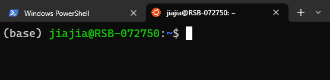

# Week 1 - Basic Linux commands 

## Contents today 

* Linux operating system
* Command Line Interface (CLI)
* Linux commands and syntax 
* Linux file system 

* Structure and file path 
* Moving between directories 
* Creating, deleting, copying, moving, and renaming files and directories 
* Editing and viewing files 

* Getting help with a command 
* Using shortcuts 
* Using tmux 

# Linux operating system

## What is Linux? 

Linux is a free and open-source operating system that is widely used in various computing devices, from personal computers to servers, mobile devices, embedded systems, and more. It was created by Linux Torvalds in 1991 and is based on the Unix operating system. Popular Linux distributions include Debian, Fedora Linux, and Ubuntu. 

## Linux in biology research 

Linux is extensively used in biology research due to its versatility, robustness, and vast collection of software tools and libraries. 

__Bioinformatics__: Linux offers a wide range of powerful tools and software packages for tasks such as sequence alignment, variant calling, genome assembly, gene expression analysis, next-generation sequencing analysis and more. Popular tools include BLAST, Bowtie, SAMtools, BWA, and Genome Analysis Toolkit (GATK). Linux is also popular in the field of molecular modelling, molecular dynamics simulations, and drug discovery. Software packages like GROMACS, AMBER, AutoDock, and VMD are widely used on Linux for tasks such as protein structure prediction, ligand docking, and virtual screening. 

__High-performance computing (HPC) and cluster computing__: Linux is the dominant operating system in the field of high-performance computing. It is commonly used on supercomputers and computing clusters for running computationally intensive bioinformatics analyses, simulations, and large-scale data processing tasks. 

__Server and web hosting__: Linux-based servers are widely used for hosting biological databases, online bioinformatics tools, and web-based resources for researchers and the scientific community.

# Command Line Interface (CLI)

A command-line interface is a text-based interface used to interact with a computer operating system or software by typing commands into a terminal or command prompt. In a CLI, users communicate with the computer through text commands rather than using graphical user interfaces (GUIs) with windows, menus, and buttons.

In a CLI, users typically enter commands as text strings followed by pressing the Enter/Return key to execute the command. These commands are interpreted by the operating system or software, which then performs the requested actions or provides the desired information. 

__Please open a new terminal__

You may see something like this:

This is your command line interface, it may look slightly different depending on your device but they share the similar elements.

* __User name__: before the @ sign is your user name. For the example figure, the user name is `jiajia`.
* __Device name__: after the @ sign is your device name. For the example, the device name is `RSB-072750`.
* __Your location__: after the colon and before the $ sign is your location on the device. For the example, the location we are at is `~` which means the home directory. 
* __Command to run__: after the $ sign is where you type the command. 
* __Environment name (optional)__: at the beginning of the command prompt with a bracket, it means the environment you are in. It only shows when you have installed a environment management software on your device, such as Conda or Mamba. For the example, the environment name is `base`. 

Below is also a good example image, you can try the command `date` in there. 

 

# Linux commands and syntax 

__Q: what are the ways you interact with a Windows/MacOS?__ 

## Linux commands 

In Linux, the only way to interact with the system is through the command line. Different commands perform different tasks, and a command can be very simple or very complicated. In this class, we will start with the simple and useful commands. 

## The syntax of Linux commands 

A Linux command is usually composed of 3 different parts, and they are separated by a space character. 

 

* __Command__: the command to perform a certain task.
* __Option/Flag__: to add functions on the command to perform the task slightly differently. 
* __Argument__: a file/location which we want our command to perform on. 

__Please try the command in the above image__ 

* Options and arguments are optional for some commands, some commands can run only by itself. For example, you can run `ls` just by itself. 
* You can use more than one options for a command. For example, `ls -F -a` also works. 
* It is also possible to have more than one argument for a command, but it depends on commands. For example, `ls -F / /mnt` works as well. 

# Linux file system 

File system is the structure and organisation of files and directories. In Linux, the files system starts from the root directory `/` and branches out into subdirectories and files. 

 

Because there is no graphic user interface (GUI) for Linux, we can imagine a tree-like organisation to help us understand the relationships between directories. 

* __Root directory `/`__: root directory is the top-level directory and serves as the starting point of the file system hierarchy. All other directories and files are located within the root directory or its subdirectories. 
* __Path__: a path is a string that represents the location of a file or directory within the file system. It can be either absolute or relative. An absolute path starts from the root directory `/`, while a relative path is specified relative to the current directory. 

