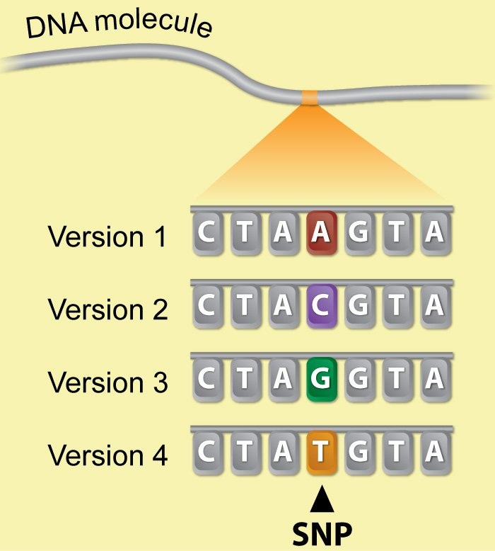
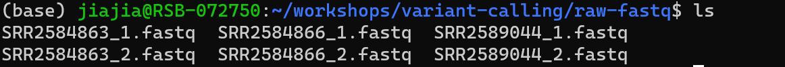
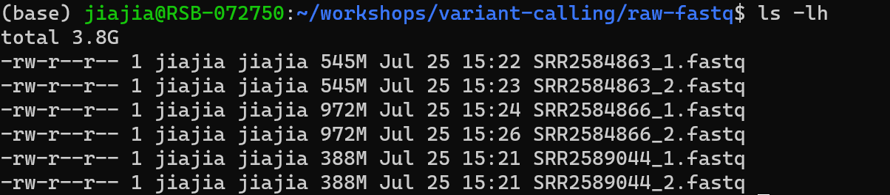
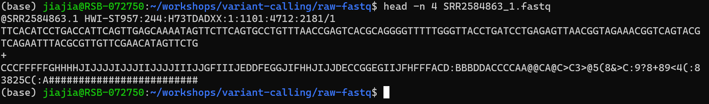
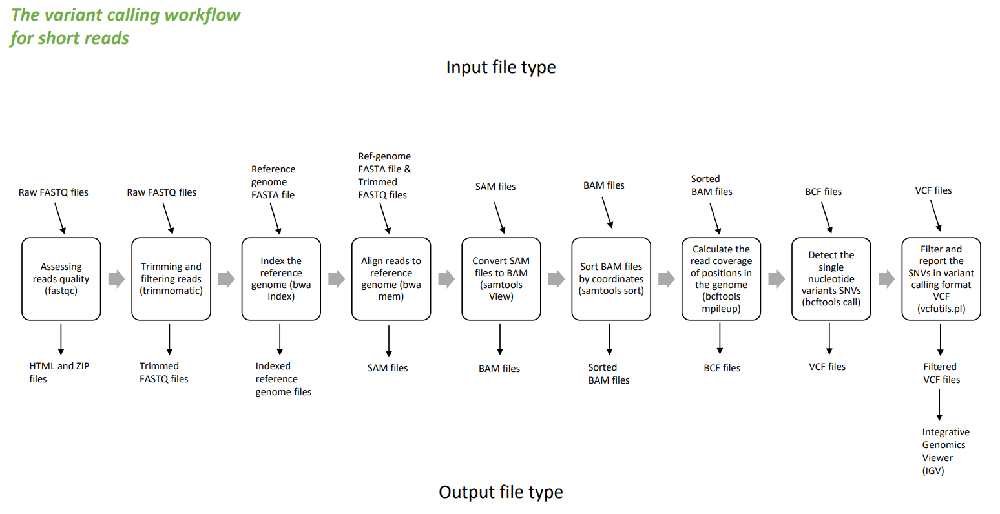
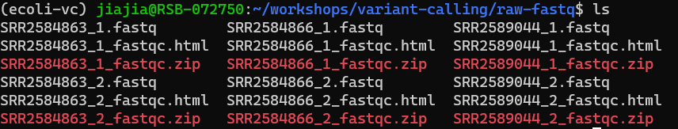

# Workshop 3 - Variant calling workflow 

## Learning objectives 

* Understand what is variant calling
* Understand the background of our data 
* Understand what is paired-end sequencing 
* Understand the FASTQ file format 
* Be able to use FastQC to assess the quality of sequencing data 
* Be able to interpret the FastQC results
* Be able to use Trimmomatic to remove low quality sequence
* Be able to use for loop to run Trimmomatic on multiple samples 
* Understand the importance of organising your working directory

# Variant calling 

## What is variant calling?

Variant calling is a bioinformatics process used in genomics to identify genetic variations between the genome of an individual and a reference genome. These variations can include single-nucleotide polymorphisms (SNPs), small insertions and deletions (indels), and larger structural variants.  



## The data 

* The data we are going to use is part of a long-term evolution experiment led by [Richard Lenski](https://en.wikipedia.org/wiki/E._coli_long-term_evolution_experiment). 
* The experiment was designed to assess adaptation in E. coli. A population was propagated for more than 40,000 generations in a __glucose-limited__ minimal medium (in most conditions glucose is the best carbon source for E. coli, providing faster growth than other sugars). This medium was supplemented with __citrate__, which E. coli cannot metabolise in the aerobic conditions of the experiment. 
* Sequencing of the populations at regular time points revealed that spontaneous citrate-using variant (__Cit+__) appeared between 31,000 and 31,500 generations, causing an increasing in population size and diversity. 

We will be working with 3 sample events from the Ara-3 strain of this experiment, one from 5,000 generations, one from 15,000 generations, and one from 50,000 generations. The population changed substantially during the course of the experiment, and we will be exploring how with our variant calling workflow. 

__Q: What do you expect the trend to be for the number of variants of the 3 samples?__ 

We have downloaded the files, and it should be in our `~/workshops/variant-calling/raw-fastq/` directory. Let's go into that directory and have a look.

__Exercise: please go to directory `~/workshops/variant-calling/raw-fastq` and list the files.__

You should see:


You might notice that our fastq files have the `.gz` extension behind, anyone knows the meaning of it? 

__Search on the internet what does `.gz` means? What is the command to decompress `.gz` files?__

__Exercise: please decompress all 6 files in one line of code.__ 

Your result should look like: 



__Exercise: check the size of the decompressed files.__ 

Your result should look like: 



## Paired-end sequencing 

You might notice that our files contain `_1` and `_2` in the filename, and before that the filenames are the same. It means our sample were sequenced from both ends and it came out as two separate files. In the analysis, we will use both of the files. 

## FASTQ file format 

FASTQ format is a text-based format for storing both a biological sequence (usually nucleotide sequence) and its corresponding quality scores. 

It was originally developed to bundle a FASTA formatted sequence and its quality data, but has recently become the de facto standard for storing the output of high-throughput sequencing instruments such as the Illumina Genome Analyzer. 

A FASTQ file has four line-separated fields per sequence:

* Line 1 begins with a `@` character and is followed by a sequence identifier and an optional description.
* Line 2 is the raw sequence letters. 
* Line 3 begins with a `+` character and is optionally followed by the same sequence identifier (and any description) again. 
* Line 4 encodes the quality values for the sequence in line 2, and must contain the same number of symbols as letters in the sequence. 

We can view the first complete read in one of our files by using head command to look at the first 4 lines:

```sh
head -n 4 SRR2584863_1.fastq 
```

And you should see:



Line 4 shows the quality for each nucleotide in the read, the quality here means the base call accuracy (e.g. 90%). Base calling is the method used to decode the raw signals generated during the sequencing process into the corresponding DNA sequence. 

To make it possible to line up each individual nucleotide with its quality score, the numerical score is converted into a code where it uses letters and special characters to represent the score. There are different encoding format where characters mean different scores, the quality control software usually can automatically detect the encoding format.

# Bioinformatic workflow 

When working with high-throughput sequencing data, the raw reads you get off of the sequencer will need to pass through a number of different tools in order to generate your final desired output. The execution of this set of tools in a specified order is commonly referred to as a workflow or a pipeline. 

There are 9 steps for our variant calling workflow, and we will learn it step by step with hands-on coding exercise. 



## 1. Assessing reads quality using FastQC 

FastQC aims to provide a simple way to do some quality control checks on raw sequence data coming from high throughput sequencing pipelines. It provides a modular set of analyses which you can use to give a quick impression of whether your data has any problems of which you should be aware before doing any further analysis. 

Rather than looking at quality scores for each individual read, FastQC looks at quality collectively across all reads within a sample. The image below shows one FastQC-generated plot that indicates a very high quality sample:


The x-axis displays the base position in the read, and the y-axis shows quality scores. In this example, the sample contains reads that are 40 bp long. This is much shorter than the reads we are working with in our workflow. 

For each position, there is a box-and-whisker plot showing the distribution of quality scores for all reads at that position. The horizontal red line indicates the median quality score and the yellow box shows the 1st to 3rd quartile range. This means that 50% of reads have a quality score that falls within the range of the yellow box at that position. The whiskers show the absolute range, which covers the lowest (0th quartile) to highest (4th quartile) values. 

For each position in this sample, the quality values do not drop much lower that 32. This is a high quality score. The plot background is also colour-coded to identify good (green), acceptable (yellow), and bad (red) quality scores. 

Now let's take a look at a quality plot on the other end of the spectrum. 


Here, we see positions within the read in which the boxes span a much wider range. Also, quality scores drop quite low into the "bad" range, particularly on the tail end of the reads. The FastQC tool produces several other diagnostic plots to assess sample quality, in addition to the one plotted above. 

### 1.1. Running FastQC on our data 

First, make sure you have activate your conda environment.

```sh
conda activate ecoli-vc
```

Then, let's validate that FastQC is installed by getting the help document for FastQC.

```sh
fastqc -h 
```

You should see: 

```

            FastQC - A high throughput sequence QC analysis tool

SYNOPSIS

        fastqc seqfile1 seqfile2 .. seqfileN

    fastqc [-o output dir] [--(no)extract] [-f fastq|bam|sam]
           [-c contaminant file] seqfile1 .. seqfileN

DESCRIPTION

    FastQC reads a set of sequence files and produces from each one a quality
    control report consisting of a number of different modules, each one of
    which will help to identify a different potential type of problem in your
    data.

    If no files to process are specified on the command line then the program
    will start as an interactive graphical application.  If files are provided
    on the command line then the program will run with no user interaction
    required.  In this mode it is suitable for inclusion into a standardised
    analysis pipeline.

    The options for the program as as follows:

    -h --help       Print this help file and exit

    -v --version    Print the version of the program and exit

    -o --outdir     Create all output files in the specified output directory.
                    Please note that this directory must exist as the program
                    will not create it.  If this option is not set then the
                    output file for each sequence file is created in the same
                    directory as the sequence file which was processed.
... 
```

The help document usually gives you guidelines about how to use the software. 

Then, let's change directory to where we store our data files.

```sh
cd ~/workshops/variant-calling/raw-fastq/
```

FastQC can accept multiple files as input, and on both zipped and unzipped files, since we have unzipped all of our files, we can use wild card `*.fastq` to represent our file names. 

```sh
fastqc *.fastq
```

You will see an automatically updating output message telling you the progress of the analysis:

```
Started analysis of SRR2584863_1.fastq
Approx 5% complete for SRR2584863_1.fastq
Approx 10% complete for SRR2584863_1.fastq
Approx 15% complete for SRR2584863_1.fastq
Approx 20% complete for SRR2584863_1.fastq
Approx 25% complete for SRR2584863_1.fastq
Approx 30% complete for SRR2584863_1.fastq
...
```

It should take about 5 minutes to finish running on all 6 files. When the analysis completes, your prompt will return. 

The FastQC program has created several new files within our `raw-fastq` directory. We can use `ls` to have a look. You should see:



For each input FASTQ file, FastQC has created a `.zip` file and a `.html` file. 

Let's take a look at what is the `.html` file about. To open a `.html` file on WSL, you need to open the File Explorer on your Windows system, and on the left pane you will see a penguin icon and a folder for Ubuntu.

 

Then follow the path `/home/jiajia/workshops/variant-calling/raw-fastq/` to go to the `raw-fastq` directory and open the html files. If you are on a Mac computer, you can open your Finder and press `cmd+shift+H` to go to your home directory, then follow the path to find your html files. 

### 1.2. Decoding the other FastQC outputs 

We have now looked at a few "Per base sequence quality" FastQC graphs, but there are nine other graphs in the result html file that we have not talked about. Below we have provided a brief overview of interpretations for each of these plots. For more information, please see the FastQC documentation [here](https://www.bioinformatics.babraham.ac.uk/projects/fastqc/Help/).

* __[Per tile sequence quality](https://www.bioinformatics.babraham.ac.uk/projects/fastqc/Help/3%20Analysis%20Modules/12%20Per%20Tile%20Sequence%20Quality.html):__ the machines that perform sequencing are divided into tiles. This plot displays patterns in base quality along these tiles. Consistently low scores are often found around the edges, but hot spots can also occur in the middle if an air bubble was introduced at some point during the run.
* __[Per sequence quality scores](https://www.bioinformatics.babraham.ac.uk/projects/fastqc/Help/3%20Analysis%20Modules/3%20Per%20Sequence%20Quality%20Scores.html):__ a density plot of quality for all reads at all positions. This plot shows what quality scores are most common.
* __[Per base sequence content](https://www.bioinformatics.babraham.ac.uk/projects/fastqc/Help/3%20Analysis%20Modules/4%20Per%20Base%20Sequence%20Content.html):__ plots the proportion of each base position over all of the reads. Typically, we expect to see each base roughly 25% of the time at each position, but this often fails at the beginning or end of the read due to quality or adapter content.
* __[Per sequence GC content](https://www.bioinformatics.babraham.ac.uk/projects/fastqc/Help/3%20Analysis%20Modules/5%20Per%20Sequence%20GC%20Content.html):__ a density plot of average GC content in each of the reads.
* __[Per base N content](https://www.bioinformatics.babraham.ac.uk/projects/fastqc/Help/3%20Analysis%20Modules/6%20Per%20Base%20N%20Content.html):__ the percent of times that ‘N’ occurs at a position in all reads. If there is an increase at a particular position, this might indicate that something went wrong during sequencing.
* __[Sequence Length Distribution](https://www.bioinformatics.babraham.ac.uk/projects/fastqc/Help/3%20Analysis%20Modules/7%20Sequence%20Length%20Distribution.html):__ the distribution of sequence lengths of all reads in the file. If the data is raw, there is often on sharp peak, however if the reads have been trimmed, there may be a distribution of shorter lengths.
* __[Sequence Duplication Levels](https://www.bioinformatics.babraham.ac.uk/projects/fastqc/Help/3%20Analysis%20Modules/8%20Duplicate%20Sequences.html):__ A distribution of duplicated sequences. In sequencing, we expect most reads to only occur once. If some sequences are occurring more than once, it might indicate enrichment bias (e.g. from PCR). If the samples are high coverage (or RNA-seq or amplicon), this might not be true.
* __[Overrepresented sequences](https://www.bioinformatics.babraham.ac.uk/projects/fastqc/Help/3%20Analysis%20Modules/9%20Overrepresented%20Sequences.html):__ A list of sequences that occur more frequently than would be expected by chance.
* __[Adapter Content](https://www.bioinformatics.babraham.ac.uk/projects/fastqc/Help/3%20Analysis%20Modules/10%20Adapter%20Content.html):__ a graph indicating where adapater sequences occur in the reads.

Now we have finished interpreting the html file, we can take a look at the zip files.

Our zip files are compressed files. They each contain multiple different types of output files for a single input FASTQ file. To view the contents of a zip file, we can use the program unzip to decompress these files. Let's try doing them all at once using a wildcard. 

```sh
unzip *.zip
```

What output did you get? 

```
Archive:  SRR2584863_1_fastqc.zip
caution: filename not matched:  SRR2584863_2_fastqc.zip
caution: filename not matched:  SRR2584866_1_fastqc.zip
caution: filename not matched:  SRR2584866_2_fastqc.zip
caution: filename not matched:  SRR2589044_1_fastqc.zip
caution: filename not matched:  SRR2589044_2_fastqc.zip
```

This did not work. This is because `unzip` expects to get only one zip file as input. We could go through and unzip each file one at a time, but this is very time consuming and error-prone. 

__Exercise: use for loop to unzip the 6 zip files.__

When you run the for loop, you will see output that starts like this:

```
Archive:  SRR2584863_1_fastqc.zip
   creating: SRR2584863_1_fastqc/
   creating: SRR2584863_1_fastqc/Icons/
   creating: SRR2584863_1_fastqc/Images/
  inflating: SRR2584863_1_fastqc/Icons/fastqc_icon.png
  inflating: SRR2584863_1_fastqc/Icons/warning.png
  inflating: SRR2584863_1_fastqc/Icons/error.png
  inflating: SRR2584863_1_fastqc/Icons/tick.png
  inflating: SRR2584863_1_fastqc/summary.txt
  inflating: SRR2584863_1_fastqc/Images/per_base_quality.svg
  inflating: SRR2584863_1_fastqc/Images/per_base_quality.png
... 
```

The unzip program is decompressing the zip files and creating a new directory for it to store all of the different output that are produced by FastQC.

__Exercise: go into one of the output folders and take a look what information are provided there?__

### 1.3. Organising our work 

If you take a look of your `raw-fastq` directory, it is already a little bit messy with many different types of files in. 

__Exercise: to make our working directory clean and organised, create a new directory called `results` under `raw-fastq` and put all the FastQC results in there.__ 

## 2. Trimming and filtering reads using Trimmomatic 

From the FastQC results, we know that some of our samples have failed a few quality metrics. This does not mean that our samples should be thrown out. It is very common to have some quality metrics fail, and this may or may not be a problem for your downstream application. 

For our variant calling workflow, we will remove some of the low quality sequences to reduce out false positive rate due to sequencing error. We will use a program called Trimmomatic to filter poor quality reads and trim poor quality bases from our samples. 

__Trimmomatic__ is a fast, multithreaded command line tool that can be used to trim and crop Illumina (FASTQ) data as well as to remove adapters. These adapters can pose a real problem depending on the library preparation and downstream application. 

There are two major modes of the program: paired end mode and single end mode. The paired end mode will maintain correspondence of read pairs and also use the additional information contained in paired reads to better find adapter or PCR primer fragments introduced by the library preparation process. 

Trimmomatic has a variety of options to trim your reads. If we run the following command, we can see some of our options. 

```sh
trimmomatic 
```

Which will give you the following output: 

```
Usage:
       PE [-version] [-threads <threads>] [-phred33|-phred64] [-trimlog <trimLogFile>] [-quiet] [-validatePairs] [-basein <inputBase> | <inputFile1> <inputFile2>] [-baseout <outputBase> | <outputFile1P> <outputFile1U> <outputFile2P> <outputFile2U>] <trimmer1>...
   or:
       SE [-version] [-threads <threads>] [-phred33|-phred64] [-trimlog <trimLogFile>] [-quiet] <inputFile> <outputFile> <trimmer1>...
   or:
       -version
```

This output shows us that we must first specify whether we have paired end (PE) or single end (SE) reads. Next, we specify what flag we would like to run. For example, you can specify `-threads` to indicate the number of processors on your computer that you want Trimmomatic to use. In most cases using multiple threads (processors) can help to run the trimming faster. These flags are not necessary, but they can give you more control over the command.

In paired end mode, Trimmomatic expects the two input files, and then the names of the output files. These files are described below. While, in single end mode, Trimmomatic will expect 1 file as input. 

* __\<inputFile1>__: input reads to be trimmed, typically the filename will contain an `_1` or `_R1` in the name. 
* __\<inputFile2>__: input reads to be trimmed, typically the filename will contain an `_2` or `_R2` in the name.
* __\<outputFile1P>__: output file that contains surviving pairs from the `_1` file. 
* __\<outputFile1U>__: output file that contains orphaned reads from the `_1` file. 
* __\<outputFile2P>__: output file that contains surviving pairs from the `_2` file. 
* __\<outputFile2U>__: output file that contains orphaned reads from the `_2` file. 

Following the filenames, trimmomatic expects to see is the trimming parameters:

* `ILLUMINACLIP`: perform adapter removal.
* `SLIDINGWINDOW`: perform sliding window trimming, cutting once the average quality within the window falls below a threshold. 
* `MINLEN`: drop an entire read if it is below a specified length. 

There are more parameters such as `LEADING`, `TRAILING`, and `CROP` etc., but we will only use `ILLUMINACLIP`, `SLIDINGWINDOW`, and `MINLEN` in our analysis. It is important to understand the steps you are using to clean your data. For more information about the Trimmomatic arguments and options, see the [Trimmomatic manual](http://www.usadellab.org/cms/uploads/supplementary/Trimmomatic/TrimmomaticManual_V0.32.pdf).

A complete command for Trimmomatic will look something like this:

```sh
trimmomatic PE -threads 4 SRR_1056_1.fastq SRR_1056_2.fastq  \
              SRR_1056_1.trimmed.fastq SRR_1056_1un.trimmed.fastq \
              SRR_1056_2.trimmed.fastq SRR_1056_2un.trimmed.fastq \
              ILLUMINACLIP:SRR_adapters.fa SLIDINGWINDOW:4:20
```

For each of the component in the command, it means:

* `PE`: tells Trimmomatic that it will be taking paired end files as input.
* `-threads 4`: use 4 computing threads to run.
* `SRR_1056_1.fastq`: the first input file.
* `SRR_1056_2.fastq`: the second input file. 
* `SRR_1056_1.trimmed.fastq`: the output file for surviving reads from the `_1` file. 
* `SRR_1056_1un.trimmed.fastq`: the output file for orphaned reads from the `_1` file. 
* `SRR_1056_2.trimmed.fastq`: the output file for surviving reads from the `_2` file. 
* `SRR_1056_2un.trimmed.fastq`: the output file for orphaned reads from the `_2` file. 
* `ILLUMINACLIP:SRR_adapters.fa`: to clip the Illumina adapters from the input file using the adapter sequences listed in `SRR_adapters.fa`.
* `SLIDINGWINDOW:4:20`: to use a sliding window of size 4 that will remove bases if their phred score is below 20. 

__Multi-line commands__: some of the commands we run in this lesson are long! When typing a long command into your terminal, you can use the `\` character to separate code chunks onto separate lines. This can make our code more readable. 

### 2.1. Running Trimmomatic 

Now we will run Trimmomatic on our data. To begin, navigate to your `raw-fastq` data directory:

```sh
cd ~/workshops/variant-calling/raw-fastq/
```

We are going to run Trimmomatic on one of our paired-end samples. While using FastQC we saw that Nextera adapters were present in out samples. The adapter sequences came with the installation of Trimmomatic, so we will first copy these sequences into our current directory. 

```sh
cp ~/anaconda3/pkgs/trimmomatic-0.36-6/share/trimmomatic-0.36-6/adapters/NexteraPE-PE.fa ./
```

__Note__: you may not find the adapter file in the exact same location, please go into directory `~/anaconda3/pkgs/` to check which version of Trimmomatic and change the file path.

The trimming parameters that we will apply on our data are:

1. A sliding window of size 4 that will remove bases if their phred score is below 20.
2. Discard any reads that do not have at least 25 bases remaining after the above step. 
3. Handle sequences that match with the Nextera adapters using parameter 2:40:15. We won't cover what the numbers mean as it is too advance for this course. 

The code should look like:

```sh
trimmomatic PE SRR2589044_1.fastq SRR2589044_2.fastq \
                SRR2589044_1.trim.fastq SRR2589044_1un.trim.fastq \
                SRR2589044_2.trim.fastq SRR2589044_2un.trim.fastq \
                SLIDINGWINDOW:4:20 MINLEN:25 ILLUMINACLIP:NexteraPE-PE.fa:2:40:15
```

It will take a few minutes to run, after finish running you can take a look of the output files. 

We have just successfully run Trimmomatic on one of our FASTQ files. However, we have 2 more samples to do, and in real life we usually have more samples. It would be good if we can use for loop to run this. 

```sh
for file in *_1.fastq
do
base=$(basename ${file} _1.fastq)
trimmomatic PE ${file} ${base}_2.fastq \
            ${base}_1.trim.fastq ${base}_1un.trim.fastq \
            ${base}_2.trim.fastq ${base}_2un.trim.fastq \
            SLIDINGWINDOW:4:20 MINLEN:25 ILLUMINACLIP:NexteraPE-PE.fa:2:40:15
done
```

__Exercise: please explain each line of the code above, use internet resource.__

If you are confused about the example, I have another one if it's easier to understand.

```sh
for i in SRR2584863 SRR2584866 SRR2589044
do
fastq1=${i}_1.fastq
fastq2=${i}_2.fastq
trim1=${i}_1.trim.fastq
trim2=${i}_2.trim.fastq
untrim1=${i}_1un.trim.fastq
untrim2=${i}_2un.trim.fastq

trimmomatic PE $fastq1 $fastq2 \
                $trim1 $untrim1 \
                $trim2 $untrim2 \
                SLIDINGWINDOW:4:20 MINLEN:25 ILLUMINACLIP:NexteraPE-PE.fa:2:40:15

done
```

The above example works with small amount of samples, if you have a larger sample size, you can write the for loop in this way:

```sh
for i in *_1.fastq
do
base=$(basename $i _1.fastq)

fastq1=${base}_1.fastq
fastq2=${base}_2.fastq
trim1=${base}_1.trim.fastq
trim2=${base}_2.trim.fastq
untrim1=${base}_1un.trim.fastq
untrim2=${base}_2un.trim.fastq

trimmomatic PE $fastq1 $fastq2 \
                $trim1 $untrim1 \
                $trim2 $untrim2 \
                SLIDINGWINDOW:4:20 MINLEN:25 ILLUMINACLIP:NexteraPE-PE.fa:2:40:15

done
```

Once it is done running, take a look at your directory contents. You will see there are output files for all of our samples. 

__Question: we have run Trimmomatic on sample `SRR2589044` before, did you get any error for running it again? If not, what do you think has happended?__

We have now completed the trimming and filtering steps of our quality control process. Before we move on, to make our working directory clean and tidy, it is better to move the trimmed fastq files to a new directory. 

```sh
mkdir ../trimmed-fastq/
mv *.trim.fastq ../trimmed-fastq/
cd ../trimmed-fastq
ls
```

# Homework

Run FastQC on the trimmed FASTQ files and visualise the HTML files to see whether the quality is higher after trimming. 

# References

* Wikipedia - [FASTQ format](https://en.wikipedia.org/wiki/FASTQ_format) 
* Data Carpentry - [Data Wrangling and Processing for Genomics](https://datacarpentry.org/wrangling-genomics/index.html)
* Usadel Lab - [TrimmomaticManual_V0.32](http://www.usadellab.org/cms/uploads/supplementary/Trimmomatic/TrimmomaticManual_V0.32.pdf)