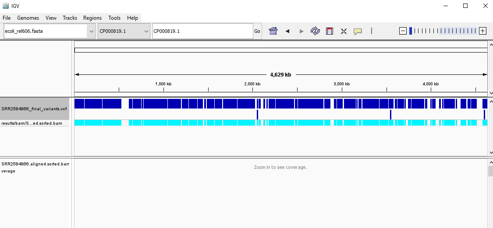
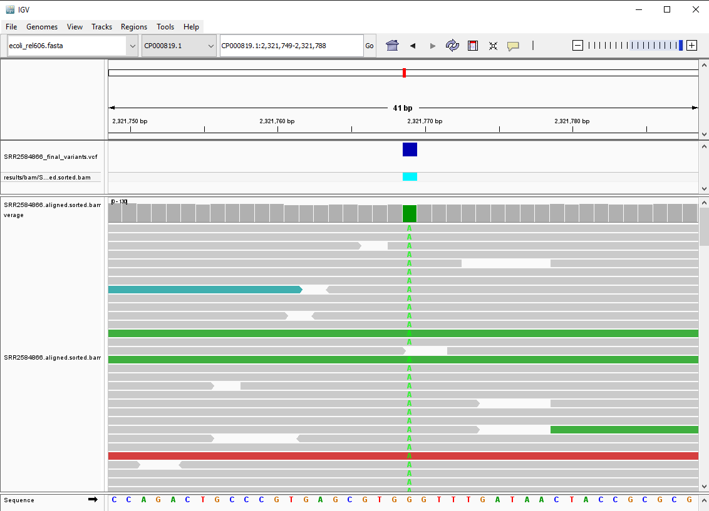

# Workshop 5 - Result Visualisation & Shell Script 

## Learning objectives 

* Understand what is a genome browser and what it does
* Be able to index BAM files
* Be able to load reference genome, vcf files, and BAM files into IGV
* Be able to understand the meaning of different tracks and components
* Understand what is a shell script and what it does
* Be able to write and run a shell script 
* Be able to combine the variant calling workflow into a single script 

## 1. Viewing the variant calling results in a genome browser

A genome browser is a graphical interface for displaying information for genomic data. Genome browsers enable users to visualise and browse entire genomes with annotated data, including gene prediction, gene structure, protein, expression, regulation, variation, and comparative analysis.

The [Integrative Genomics Viewer](https://software.broadinstitute.org/software/igv/) (IGV) is a stand-alone browser, which has the advantage of being installed locally and providing fast access. Web-based genome browsers, like [Ensembl](https://www.ensembl.org/index.html) or the [UCSC browser](https://genome.ucsc.edu/), are slower, but provide more functionality.

It is often instructive to look at your data in a genome browser. Visualisation will allow you to get a "feel" for the data, as well as detecting abnormalities and problems. Also, exploring the data in such a way may give you ideas for further analyses.

For example, the variant calling software can't always detect large insertions. It often shows as a bump on the coverage track. 

### 1.1. Indexing BAM file

IGV requires that BAM files have an associated index file. We can use `index` command from SAMtools. 

```sh
samtools index [aligned.sorted.bam]
```

__Exercise: please index all 3 samples.__ 

### 1.2. Load files into IGV 

Next, we can start to visualise our data. 

1. Open IGV.
2. Load our reference genome file `ecoli_rel606.fasta` into IGV using the "Load Genomes from File ..." option under the "Genomes" pull-down menu.
3. Load our BAM file `SRR2584866.aligned.sorted.bam` using the "Load from File ..." option under the "File" pull-down menu.
4. Do the same with our VCF file `SRR2584866_final_variants.vcf`.

Your IGV browser should look like:



There should be two tracks: one corresponding to our BAM file and the other for our VCF file.

Try zoom in using the scale at the top-right corner to inspect the variants. It should look like this:



__Exercise: try click different components and see what information you get?__

### 1.3. Import multiple samples

IGV allows you to import multiple alignment together and compare them. 

__Please load all 3 of our samples into IGV and compare them.__

Did you find anything interesting? 

For more information about IGV, you can read this [page](https://software.broadinstitute.org/software/igv/AlignmentData). 

## 2. Writing a shell script for the variant calling workflow 

A shell script is a text file that allows you to combine your sequence of commands together and run it all at once. If you have the need to run the same commands repeatedly, it is a good idea to consider writing a shell script so you can use it the next time. 

Like Python or R, a shell script can contain parameters and comments. 

### 2.1. A simple shell script

First, let's write a simple shell script to learn all the elements we need for successfully running a shell script. In this script, we will write a interactive conversation between the user and computer. 

__1. Create a new text file__

As we learned before, we can use `nano` to create new files and input text in. 

```sh
cd ~/workshops/variant-calling
nano simple_script.sh
```

__2. Write the code__

Because we want to write a interactive conversation it means we need to get information from user so the program can interact with them. To get input from user, we can use the command `read`, it takes parameter name as the argument. Try:

```sh
read variable_1
```

It will prompt to you an empty line and you can type text in and hit `enter`.

To use the information stored to that parameter, we can type `variable_1`. Try:

```sh
echo $variable_1
```

You should get whatever you input printed on the screen. 

__Exercise: use `echo` and `read` to create an interactive conversation and type it into the script, and save and exit the script.__ 

__3. Running the script__

To run the script, all we need to do is run `sh [path/to/script]` in the command line. Please run the script you just wrote. 

You should be prompted with questions and got answers from the computer based on how many code you've written in the script. But overall, you get an idea of how this script running process works.

### 2.2. Write a script for the variant calling workflow. 

__Exercise: use `SRR2584863` as an example, from the alignment step to final variants, combine all the commands needed into a script. Try use variables to make your code look simple.__ 

For example, you can use a shorter name to represent your file name:

```sh
ref_genome=./ref-genome/ecoli_rel606.fasta
sample="SRR2584863"

bwa mem $ref_genome ./trimmed-fastq/${sample}_1.trim.fastq ./trimmed-fastq/${sample}_2.trim.fastq > results/sam/$sample.aligned.sam
```

__Did you notice that I've used some `$` and some `$` with `{}`, why? Try remove the `{}` and run it again.__  

# Homework

Write a shell script for the variant calling workflow, from the very beginning quality control until you get the final variants. Use for loop to loop through samples when necessary. 

# References 

* Melbourne Bioinformatics - [Introduction to Genome Browsers](https://www.melbournebioinformatics.org.au/tutorials/tutorials/Genome_browsers/GenomeBrowsers_Intro/)
* Data Carpentry - [Data Wrangling and Processing for Genomics](https://datacarpentry.org/wrangling-genomics/index.html)
* TechTarget - [shell script](https://www.techtarget.com/searchdatacenter/definition/shell-script) 
* Guru99 - [Shell Scripting Tutorial: How to Create Shell Script in Linux/Unix](https://www.guru99.com/introduction-to-shell-scripting.html)